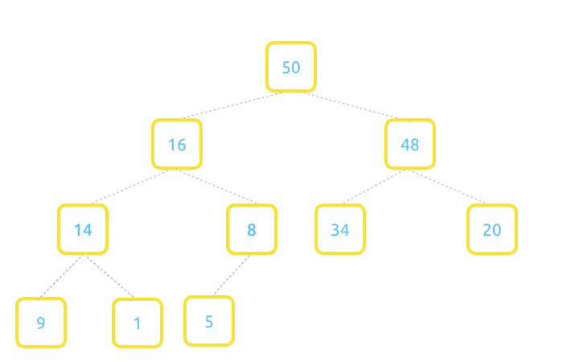
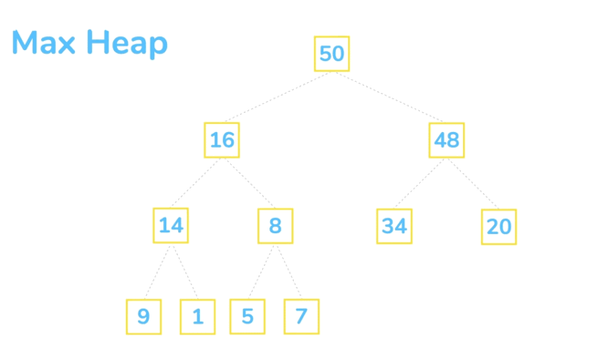
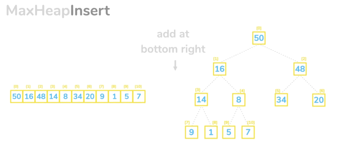
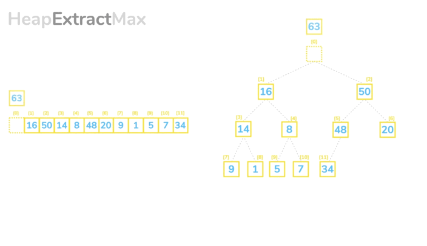

# Что такое Heap?

Heap - это структура данных которая может быть представлена в виде полного бинарного дерева.
Полнота бинарного дерева означает, что все уровни дерева заполнены, за исключением последнего, где некоторые узлы могут отсутствовать, но те что присутствуют - находятся слева. 
Пример полного бинарного дерева:


Heap может быть отсортирован по убыванию (max heap) и по возрастанию (min heap).
В случае max heap узел с наибольшим значением находится в корне дерева, каждый родительский узел имеет болшее зачение чем дочерний.


min heap - соответственно имеет узел с наименьшим значением в корне...

Мax heap хорошо подходит для реализации очереди с приоритетом, потому что он всегда содержит наибольшее значение в корне.

# Heap как массив

```
Left Node — 2*index +1
Right Node — 2*index +2
```

# Вставка


# Извлечение максимального значения

